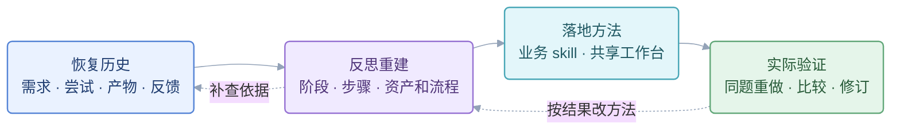

# 两个 skill 怎样配合

**session-forensics 查清过去；session-to-workflow 组织全貌、重建方法并检验效果。** 工作的结构始终是「阶段 → 步骤 → 资产和流程」。Skill 提供方法，Agent 承担职责，数量不必对应。

## 先看整个过程

这是一次工作流重建的推进过程，业务本身的阶段按目标另行归纳。主 Agent 用 session-to-workflow 组织全过程，在恢复或补查历史时使用 session-forensics；本次委托止于哪份资产，应在开始时明确。

## 各自负责什么

| 方法 | 负责 | 交给下一段什么 |
|---|---|---|
| [session-forensics](../../session-forensics/SKILL.md) | 提取原始需求及变化，核对执行、资产、反馈与矛盾；诊断过程并提出可复用线索 | 有出处和范围的事实、反证、未知与候选教训 |
| session-to-workflow | 确定恢复范围，组织案例和全貌；反思步骤取舍，设计资产及内部流程；组织落地和评价 | 工作流报告、必要的业务 skill 改动、工作台要求与有范围的验证结果 |

沿用原 skill 的读取、校准、测量和有界钻取要求，复用有效的已完成取证；按实际问题选择诊断或 harvest。运行中查进展才用 progress probe，需要完整任务续接才用 handoff。Harvest 的候选和计数需 Agent 质证，不能直接当完整工作流。取证阶段的“禁止解题”约束历史诊断，后续方法设计由 session-to-workflow 负责；不在项目 skill 复制另一套取证脚本或晋升规则。

## 中间交接：案例证据表

主 Agent 规定恢复问题，执行者通过 session-forensics 提取、核对并填写[报告模板的案例部分](workflow-report-template.md#1-这份工作流解决什么问题)。表格或案例卡均可，信息只有六项：**当时需求及输入 → 关键尝试 → 中间及最终资产 → 反馈 → 修改 → 实际结果**。每项重要判断附原始出处、资产版本与检查范围；缺失就写未知及影响。

把本人请求、代理转交、作者宣称、实际检查分开。成功需有对应产物和有限范围的接受依据；失败也要说明影响，不能只因某次工具报错判方法失败。案例表是导航和可核对的恢复结果；争议仍通过原 skill 回到物证。设计建议另写在步骤取舍处，不混入历史事实。

事实交接同时回答[目标与协作审计](intent-and-collaboration-audit.md)：请求是否足以支持路线，用户的局部修法或接受怎样影响执行，Agent 是否主动识别未知并维护目标，最终效果用了多少用户诊断与指导。现有 forensics 的目标追踪不足以单独回答这些问题，需要按原窗口核双方行为；不把新缺口一律归责用户。

## 什么时候向前走，什么时候返回

| 当前工作 | 可以向前走的依据 | 有问题时回哪里 |
|---|---|---|
| 恢复历史 | 影响阶段、关键资产及结果判断的事实可追溯；覆盖与缺口明确 | 缺口会改变结构或结果判断就定向补查；找不到则收窄结论，不能补写为事实 |
| 反思重建 | 关键调整能说明“历史做法 → 原因 → 新步骤”；每步可判断输入、输出、内部审阅与返工 | 事实争议回取证；结构不合理由主 Agent 重建；无独立交付或返工需要的小动作并入步骤内部 |
| 落地方法 | 本次授权范围内，方法可调用、资产可进入工作台；界面要求与实现状态分开 | 执行不清改 skill；找不到成果、决定或历史关系才改工作台 |
| 实际验证 | 预先固定的需求、输入、交付节点和比较问题已有实际结果与检查记录 | 按失败原因修对应方法；到约定资产就结束本次验证，未测环节保留未验证 |

历史材料不足也可以交付候选报告，但必须说明哪部分尚不能判断。写成候选 skill 便于试用，不等于经验已被证明普适。工作台承载完整阶段、资产依赖和跨轮次的意见→修订→复验；当前重点是入口，关键成果与决定持续保留。

## 两个审阅角度与最终责任

首次重建或重大调整，先有全貌和候选，再用两个 subagent 并行检查同一版本：**历史与意图**侧核原话、产物和反证；**方法与协作**侧核步骤取舍、资产流程、持续协作与验证范围。两人都能按需调用相关 skill，先独立交意见。

历史侧还要检查“请求与上下文够不够支持当时决定”，方法侧还要检查“Agent 是否承担必要的诊断，以及是否减少用户负担”。不能两侧都只检查候选里已经列出的主张，而遗漏主张之外的关键未知。

主 Agent 提供判断所需的关联计划和资产入口，并列出本次审阅范围与版本。发出前检查：候选引用且会影响结论的原件是否可读，是否已列入清单；不必复制整个目录。审阅者发现缺项先定向读取或报告覆盖不足，不能推断原工作流缺失。

主 Agent 汇总分歧并修改：事实靠证据，方法靠目标与实际效果，不按票数选方案。由相关审阅者复验受影响部分，普通改字不再双审。记录双审的不同发现、投入与限制，检验其价值。

**分别判断：历史是否可信、候选方法是否可执行、工作台是否支持持续协作、同题重做是否改善结果。** 接口走查只验证配合能否执行；同题重做只支持已测步骤；全流程与跨题有效性需要相应的实际验证。
