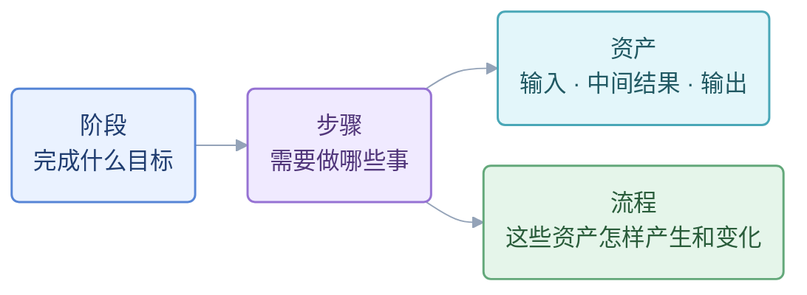
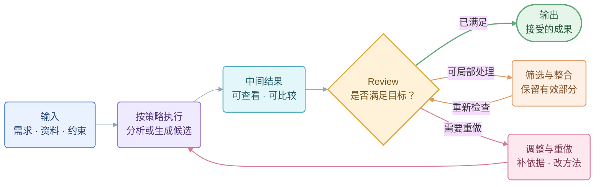

# 核心心智模型：阶段 → 步骤 → 资产和流程

用户于 2026-09-09 在原始讨论（原始私有会话链接已移除）明确确认：

> 核心心智模型就是 阶段 -> 步骤 -> 资产和流程

这是本 skill 的结构依据。具体提炼方法需要实际案例验证，不能由结构已确认推断方法已成熟。

整套结构共同回答一个目的。先把**长期目的 → 当前阶段目标 → 本轮任务**对齐，再判断哪些步骤值得做；它们是贯穿工作的上下文，不是新增的流程层级。输入中的目标、受众、成功标准与约束也需要审，Agent 负责发现关键未知、沿用已确认答案。具体判断见[目标与协作审计](intent-and-collaboration-audit.md)。

## 1. 只用这一套结构

- **阶段**：这一段要完成什么目标。
- **步骤**：为完成阶段目标，需要做哪些事。
- **资产**：这一步的输入、中间结果和输出；可以跨步骤复用。
- **流程**：资产如何被生成、审阅、筛选、修改，最终交付。

“资产和流程”是观察同一步骤的两个方面。资产不是全部私有地嵌套在步骤下：一份报告可以输入多个后续步骤，一次修改也可能影响多个下游资产。

多个账号时，工作区是这套结构的容器，各自维护目标、内容和决定。工作区按已确认的业务身份或独立协作边界划分，不机械按平台数划分。同一身份的渠道共用内容与定位、分别记录交付；跨区显式导入并保留源版本，不继承来源区的接受或发布状态；具体见[工作区与选题入口](workspace-and-topic-intake.md)。

阶段数量、步骤数量按任务决定。独立的交付、判断或返工边界是单列步骤的理由；没有这些需要的小动作可合并在一步内部，仍保留必要的中间资产和 Review。不把每次工具调用都拆成一步。

关键判断也可以保留在步骤内部：明确它的接受对象、决定与范围，把接受记录列为输出资产，并让后续步骤和工作台可见。有独立判断是考虑单列的理由，不代表必须另加一步。

## 2. 一个步骤内部的小闭环

最简单的写法是：**拿什么 → 怎么做 → 交出什么。**

策略属于“怎么做”：如何生成候选、显示哪些中间结果、按什么标准 review、筛选什么、怎样返工以及何时结束。中间结果是可检查的草稿、候选、数据或计算结果。

筛选适合已经有可用部分的情况；方向错了或缺少关键依据，需要修改或重做。筛选、修改后的结果重新检查，关键要求未满足时不能靠丢弃失败部分获得“通过”。返工回到原因所在步骤，并检查受影响的下游版本。

Review、策略、Agent、工具和其他 skill 都放在步骤内部的流程里。顺序、并行、分支和循环按需要选择；并行需要明确任务和汇合方式。作者负责修复，审阅者核对结果；用户已授权代理接受时沿用授权。没有必要把每个步骤做成独立 Agent 或独立 skill。

## 3. 从历史形成工作流报告，再形成方法

**恢复历史 → 反思重建 → 落地方法 → 实际验证。** 先建立全貌再重新取舍，属于反思重建内部。完整配合图、两个 skill 的职责和各段结束条件见[配合说明](forensics-cooperation.md)。这是重建方法的推进过程，业务工作本身不必也有四个阶段。

历史提取和原始证据核对统一使用 [session-forensics](../../session-forensics/SKILL.md)。它也负责过程诊断和候选教训；本 skill 将证据组织成案例，负责整体理解、未来设计与验证。建立全貌后需要回查时，仍用原 skill 读取物证，不能只依赖首次提取的报告。

一开始没有认知和 overview，探索会留下很多零散动作。恢复目标、输入、实际产物、反馈、修改和结果后，先看清目标与关键资产的关系，再带着全貌回看历史：哪些探索形成了可复用知识，哪些做法值得保留，哪些反复源于缺少整体理解。最终用上面的结构写成一份[工作流报告](workflow-report-template.md)，保留“历史实际如此”“用户明确要求”“建议下次这样做”的区别。

**好的步骤，是完成一个清楚目标、产出可判断资产，并让必要的审阅和返工容易发生的工作单元。** 按此判断阶段和步骤该如何调整：

| 调整 | 判断依据 |
|---|---|
| 合并 | 多个小动作服务同一目标，没有必要单独交接、判断或返工；放在一步内部即可，关键中间结果仍能查看。 |
| 保留或拆开 | 有需要独立接受的资产、影响后续的判断，或单独返工能避免连带重做；一个大步骤也可能需要拆开。 |
| 删减 | 重复劳动、已被替代的方案或已解决的一次性探索，不再提供必要价值；可复用结论留下，需要时再探索的条件写进流程。 |
| 补充或调整顺序 | 发现具体的输入、证据、判断或交接缺口；说明新动作解决什么、应在何时做，并在重做中验证价值。 |

认知形成后的流程可以更简洁，但不能用压缩名称掩盖实际工作量，也不能为了完整好看增加阶段。必要的探索仍然保留，已经学到的通用知识进入输入或方法，不必每次从零摸索。

反思也包括**判断与执行态度**：例如尚未理解目标就推进制作，或收到否定反馈后只修改表面、没有追问失败原因。写清当时可知什么、做了什么、造成什么后果、下次改变哪个动作；证据不足时标为推测。初次探索本身不等于错误，避免用事后答案评价当时本不可能知道的事情。

报告先展示阶段总图，再展开每个阶段的步骤，最后按需要展开某一步的资产和内部流程。不要把全部层次塞进一张大图；颜色用于区别输入、中间资产、Review、返工和输出。

报告让人看清重建后的做法，再把需要复用的部分写成业务 skill 或其他执行能力，并用同一需求按新流程实际生成新产物。把旧产物重新归类只验证了表达方式，不能证明新方法有效。

首次重建时，用两个 subagent 同时审阅候选：一个问“历史是否支持”，一个问“重建是否合理”。主 Agent 汇总分歧、选择改法并修改，再让相关审阅者复验。它属于重建步骤内部的流程，沿用上面的中间结果小闭环；不把双审复制到每个小动作中。具体职责见 [skill 的双角度审阅](../SKILL.md#两个角度同时审阅)。

评价的问题是：**相近投入、相同需求下，是否更容易得到满意的结果？** 比较质量、实际投入、返工和审阅负担；检查合并后关键问题能否及时发现、补充步骤是否有实际帮助。后来学到的通用方法可以固化；具体案例的答案、成品和后续提示不能悄悄成为新版独有输入。熟悉案例通过后还要检查未参与提炼的案例。

报告是方法说明，skill 是执行指导，实际产物和审阅记录是结果证据。三者相互关联，不能用其中一项的完成代替其他项。

## 4. 工作台为什么要建

**工作台是用户与 Agent 持续协作的共享上下文。** 它承载整个工作的目标、关键阶段、步骤、资产和协作过程，随着多轮沟通与执行持续积累。

Agent 持续工作时，用户的注意力会转向其他事情，未必看过中间的会话和产物。工作台承担连接双方的作用：用户随时回来，都能看懂目标、进展、结果与下一步；用户的纠正和决定也能进入同一份上下文，指导 Agent 继续工作。

核心顺序是：**建立共同理解 → 清楚地呈现与持续更新 → 在此基础上审阅、反馈和按需授权。**

当前重点帮助用户快速接回工作，完整结构帮助双方持续推进。两者在同一个工作台中连接：

| 看什么 | 应当清楚呈现什么 |
|---|---|
| 整体工作 | 整体目标、所有关键阶段和步骤、前后关系、各处进展与当前重点 |
| 目标关系 | 长期目的、阶段目标、本轮任务怎样相连；已确认受众、内容价值及仍待判断的定位 |
| 一步的成果 | 输入、关键中间结果、输出；当前版本、审阅范围和下游复用关系 |
| 持续协作 | 重要意见、决定及理由，绑定具体资产；如何修改、怎样复验、还有什么未解决 |
| 回到当前 | 这一轮在整体中的位置、最近变化、接下来做什么，以及需要用户参与什么 |

这些是同一套“阶段 → 步骤 → 资产和流程”的阅读角度，不增加新的工作流层级。所有关键阶段与资产都应有清楚入口；已完成的阶段仍然可查看、复用和在必要时重新打开。原始日志、细节与旧版本可折叠，关键决定和成果不能因切换到下一轮而消失。

用户打开工作台，应容易回答：

1. **整个工作是什么，走到了哪里？** 整体目标、关键阶段与步骤、已完成成果和当前重点。
2. **每个关键成果在哪里，怎样相互连接？** 各步输入、中间结果、输出及复用依赖，能直接打开对应版本。
3. **我们之前决定了什么，为什么？** 重要选择和否定理由、用户意见及处理结果，关联修改与复验。
4. **最近发生了什么，还有什么没解决？** 实质变化及原因、已确认结论与不确定之处。
5. **接下来怎么走，需要我参与什么？** 下一步及原因、需要关注的问题，以及确有需要的审阅或授权。

**可读性是核心能力。** 先用简短概览恢复全貌，再按阶段、步骤展开资产和流程。用用户能理解的名称与说明，突出当前重点和实质变化；图、颜色和布局帮助辨认关系与状态，含义同时用文字说明。详细记录按需展开，概览保留理解目标、变化、结果和下一步所需的信息，不要求用户补读整段 session 才看得懂。

共享上下文关联真实资产和实际记录：每步优先展示该步当前稿，注明状态依据与更新时间；可复用依据、已否定方案与历史仍可追溯。Agent 推进工作后更新对应结果与状态；用户意见定位到具体版本、段落、图或时间点，修订和决定回到同一处，避免双方各自维护一份相互矛盾的进度。上游资产改变时标明受影响的下游，不能让旧接受记录自动覆盖新版本。用户本人接受、授权代理接受、技术或读者检查保留各自范围。

据此决定最小功能和验收。先让一位未持续跟进的用户只看工作台，说明整体目标、阶段进展、最近变化、结果和下一步，并打开当前与已完成阶段的关键资产；观察哪里需要额外口头解释、哪里仍会误解。再检查跨轮次的“提出意见 → 修改与复验 → 推进到下一步 → 回看原意见与成果”：是否仍能解释当时为何选择、意见如何解决，以及哪些资产继续复用。需要授权时再检查相应操作。理解程度、记录连续性和操作可用性分别记录，按钮可点击不能证明持续协作已成立。

**工作台可用、作品合格、工作流方法有效，是三个分别验证的结果。** 工作台建设不自动把所有步骤变成全自动，也不自动要求每步都由用户批准。
